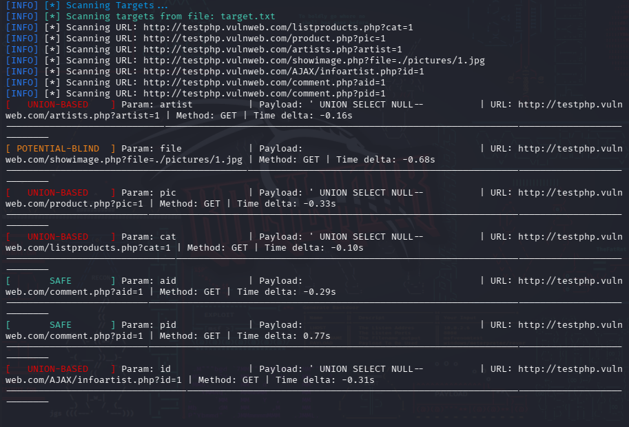

<div align="center">
  


# SQLScan


**SQLScan** is a Python-based **SQL Injection scanner** focused on *parameter testing* using response comparison techniques.

---

## Overview



SQLScan supports scanning:

GET & POST parameters • Common HTTP headers • Raw HTTP request files (Burp Suite format)

</div>

---

## Features

- **Error-Based SQL Injection**
  - Detection based on database error patterns (MySQL, PostgreSQL, MSSQL)

- **Time-Based SQL Injection**
  - Uses `SLEEP()` payloads and response time delta analysis

- **Union-Based SQL Injection**
  - Available in `--aggressive` mode
  - Detects response hash differences

- **Potential Blind SQL Injection**
  - Content-length difference heuristic

- **Header Injection Testing**
  - User-Agent
  - Referer
  - Cookie
  - Origin
  - X-Forwarded-For
  - X-Requested-With

- **Multi-threaded Scanning**
  - Up to 10 parallel threads (for multiple targets)

- **Structured Output**
  - Plain text log (`results/sqlscan.log`)
  - JSON report (`results/sqlscan_results.json`)

---

## Installation

```bash
git clone https://github.com/pangeran-droid/sqlscan.git
cd sqlscan
pip install -r requirements.txt
```

---

## Usage

### Basic Syntax
```bash
python3 sqlscan.py [options] <target>
```

### Supported Targets
- Single URL
- File containing multiple URLs
- Raw HTTP request file (Burp Suite)

---

## Command-Line Options

| Flag | Long Flag        | Description                              |
| ---- | ---------------- | ---------------------------------------- |
| `-h` | `--help`         | Show help message                        |
| `-t` | `--time`         | Enable time-based SQLi detection         |
| `-H` | `--scan-headers` | Scan SQLi in HTTP headers                |
| `-a` | `--aggressive`   | Enable UNION & blind heuristics          |
| `-b` | `--burp`         | Scan raw HTTP request file (Burp format) |

---

## Examples

### Scan a single URL
```bash
python3 sqlscan.py "http://example.com/page.php?id=1"
```

### Scan with time-based SQLi + headers
```bash
python3 sqlscan.py "http://example.com/page.php?id=1" -t -H
```

### Scan multiple targets from file
```bash
python3 sqlscan.py targets.txt -a
```

### Scan a Burp Suite request file
```bash
python3 sqlscan.py -b request.txt -t -H -a
```

---

## Output

All scan results are automatically saved in the `results/` directory:

- `sqlscan.log`  
  Scan activity log

- `sqlscan_results.json`  
Detailed findings (parameter, method, payload, type)

---

## Detection Methodology (Brief)

- Baseline response comparison
- Content normalization (timestamps, hashes, whitespace)
- Analysis based on:
  - Error messages
  - MD5 hash differences
  - Response time deltas
  - Content-length differences

---

## Project Structure

```text
sqlscan/
├── sqlscan.py
├── requirements.txt
├── results/
│   ├── sqlscan.log
│   └── sqlscan_results.json
└── README.md
```

---

## Disclaimer

This tool is**not intended for illegal exploitation**.

Use **SQLScan** only on:
- Systems you own
- Systems you have explicit written permission to test

The author is not responsible for any misuse or damage caused by this tool.

---

## Lisensi

MIT License © 2026 Pangeran
